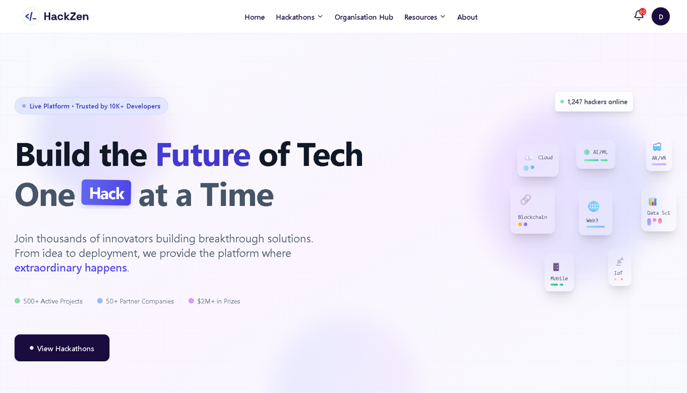
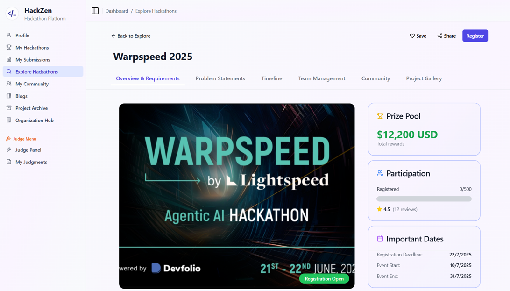
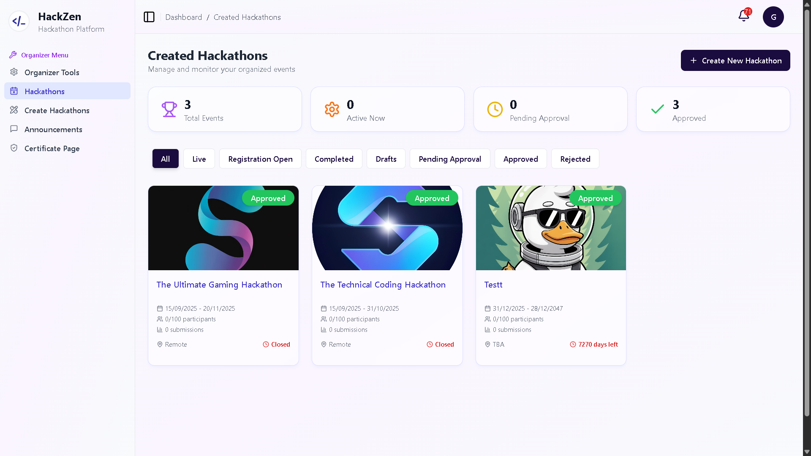

# HackZen

A full-stack **hackathon management platform** for organizers, judges, and participants. Built with React and Node.js, HackZen handles hackathon creation, team formation, submissions, judging, scoring, real-time chat, and certificates.

---

## Table of Contents

- [Features](#features)
- [Tech Stack](#tech-stack)
- [Project Structure](#project-structure)
- [Getting Started](#getting-started)
- [Environment Variables](#environment-variables)
- [Scripts](#scripts)
- [Screenshots](#screenshots)
- [API Overview](#api-overview)
- [Contributing](#contributing)
- [License](#license)
- [Contact](#contact)

---

## Features

### For Participants
- **Auth**: Email/password, GitHub OAuth, Google OAuth, 2FA (TOTP)
- **Explore hackathons** with filters and detail pages
- **Register** for hackathons and join or create teams
- **Submit projects** with rich text and file uploads (Cloudinary)
- **Dashboard**: My hackathons, submissions, project archive, profile
- **Blogs & articles**, newsletter subscription
- **Badges & achievements**, certificate generation

### For Organizers
- **Create & manage hackathons** (phases, criteria, deadlines)
- **Organizer dashboard**: announcements, submissions, teams, tools
- **Judge assignment** and scoring workflow
- **Sponsor proposals** with real-time chat (Socket.IO)
- **Certificate page** builder and export

### For Judges
- **Judge panel** with assigned projects and scoring
- **Score submissions** with criteria and comments
- **Project gallery** and submission details

### For Admins
- **Admin dashboard**: hackathons, submissions, users, content
- **Blog management**, badge management, system overview

### Platform
- **Real-time** chat (Socket.IO), notifications
- **Email** (SendGrid/Resend): password reset, invites, shortlist/winner templates
- **File uploads** via Cloudinary
- **Session** store in MongoDB; JWT for API auth

---

## Tech Stack

| Layer      | Technologies |
|-----------|--------------|
| **Frontend** | React 18, Vite 6, React Router 7, Tailwind CSS, Radix UI, Framer Motion, Socket.IO Client, Axios |
| **Backend**  | Node.js, Express 5, MongoDB (Mongoose), Passport (Local, GitHub, Google), Socket.IO, JWT, Speakeasy (2FA) |
| **Storage**  | MongoDB (MongoDB Atlas), Cloudinary (images/files) |
| **Email**    | SendGrid / Resend |
| **Deploy**   | Vercel (frontend), Render/Node (backend) |

---

## Project Structure

```
STPI-Project/
├── Frontend/                 # React + Vite app
│   ├── public/
│   ├── src/
│   │   ├── components/
│   │   ├── context/          # AuthContext
│   │   ├── hooks/
│   │   ├── lib/              # api, utils
│   │   ├── pages/            # Admin, Auth, Home, Dashboards, etc.
│   │   └── utils/
│   ├── index.html
│   ├── vite.config.js
│   └── package.json
├── backend/                  # Express API
│   ├── config/               # passport, cloudinary, socket, mailer
│   ├── controllers/
│   ├── middleware/
│   ├── model/
│   ├── routes/
│   ├── schema/
│   ├── services/             # emailService
│   ├── templates/            # email templates
│   ├── index.js
│   └── package.json
├── docs/
│   └── screenshots/          # Screenshot images for README
└── README.md
```

---

## Getting Started

### Prerequisites

- **Node.js** 18+ and npm
- **MongoDB** (local or MongoDB Atlas)
- **Cloudinary** account (for uploads)
- **SendGrid** or **Resend** (for emails)
- **GitHub** and **Google** OAuth apps (optional, for social login)

### 1. Clone and install

```bash
git clone <repository-url>
cd HackZen-main
```

**Backend:**

```bash
cd backend
npm install
```

**Frontend:**

```bash
cd ../Frontend
npm install
```

### 2. Environment variables

Create a `.env` file in `backend/` (see [Environment Variables](#environment-variables)).  
If the frontend calls the API by URL, set `VITE_API_URL` or equivalent in the frontend (e.g. in `.env`).

### 3. Run locally

**Terminal 1 – Backend**

```bash
cd backend
npm run dev
```

API runs at `http://localhost:3000` (or the port in `.env`).

**Terminal 2 – Frontend**

```bash
cd Frontend
npm run dev
```

App runs at `http://localhost:5173` (or the port Vite shows).

### 4. Production build

**Frontend**

```bash
cd Frontend
npm run build
npm run preview   # optional: preview production build
```

**Backend**

```bash
cd backend
npm start
```

---

## Environment Variables

Create `backend/.env` with (replace placeholders; do not commit secrets):

| Variable | Description |
|----------|-------------|
| `MONGO_URL` | MongoDB connection string (Atlas or local) |
| `PORT` | Server port (default `3000`) |
| `JWT_SECRET` | Secret for JWT signing |
| `SESSION_SECRET` | Secret for session encryption |
| `GITHUB_CLIENT_ID` | GitHub OAuth app client ID |
| `GITHUB_CLIENT_SECRET` | GitHub OAuth app client secret |
| `GITHUB_CALLBACK_URL` | GitHub OAuth callback URL |
| `GOOGLE_CLIENT_ID` | Google OAuth client ID |
| `GOOGLE_CLIENT_SECRET` | Google OAuth client secret |
| `GOOGLE_CALLBACK_URL` | Google OAuth callback URL |
| `CLOUDINARY_CLOUD_NAME` | Cloudinary cloud name |
| `CLOUDINARY_API_KEY` | Cloudinary API key |
| `CLOUDINARY_API_SECRET` | Cloudinary API secret |
| `SENDGRID_API_KEY` | SendGrid API key (or use Resend) |
| `SENDGRID_FROM_EMAIL` | From email for transactional emails |
| `SENDGRID_FROM_NAME` | From name (e.g. `HackZen`) |
| `FRONTEND_URL` | Frontend URL in production (e.g. `https://hackzen.vercel.app`) |
| `NODE_ENV` | `development` or `production` |

---

## Scripts

**Backend (`backend/package.json`)**

- `npm start` — run server (`node index.js`)
- `npm run dev` — run with nodemon

**Frontend (`Frontend/package.json`)**

- `npm run dev` — Vite dev server
- `npm run build` — production build
- `npm run preview` — preview production build
- `npm run lint` — run ESLint

---

## Screenshots

### Featured — Landing Page

<p align="center">
  
</p>

---

### Auth & Discovery

| Login (Email + GitHub / Google) | User Dashboard |
|----------------------------------|----------------|
|  |  |

| Explore Hackathons | Hackathon Detail |
|--------------------|------------------|
|  |  |

---

### Admin Panel

<p align="center">
  
</p>

---

### Organizer & Judge panels

| Organizer Dashboard | Judge Panel |
|---------------------|-------------|
|  |  |

---

## API Overview

Base URL (local): `http://localhost:3000`

| Area | Prefix | Description |
|------|--------|-------------|
| Health | `GET /`, `GET /api/health` | Server and API health |
| Auth | `/api/users` | Register, login, profile; OAuth callbacks |
| 2FA | `/api/users/2fa` | TOTP setup and verify |
| Hackathons | `/api/hackathons` | CRUD, list, filters |
| Registration | `/api/registration` | Hackathon registration |
| Teams | `/api/teams`, `/api/team-invites` | Teams and invites |
| Submissions | `/api/submissions`, `/api/submission-form` | Submission history and form |
| Projects | `/api/projects` | Project CRUD |
| Scores | `/api/scores` | Judge scoring |
| Judge | `/api/judge-management` | Judge assignment and management |
| Notifications | `/api/notifications` | User notifications |
| Chat | `/api/chatrooms`, `/api/messages` | Chat rooms and messages |
| Announcements | `/api/announcements` | Hackathon announcements |
| Organizations | `/api/organizations` | Organizer organizations |
| Articles | `/api/articles` | Blog/articles |
| Newsletter | `/api/newsletter` | Newsletter subscription |
| Badges | `/api/badges` | Badges and achievements |
| Uploads | `/api/uploads` | Cloudinary uploads |
| Certificates | `/api/certificate-pages` | Certificate page config |
| Sponsors | `/api/sponsor-proposals` | Sponsor proposals |

Real-time features (chat, notifications) use **Socket.IO** on the same server.

---

## Contributing

We welcome contributions from **individuals and groups/teams**.

1. **Fork** the repository to your own GitHub account.
2. **Create a feature branch** from `main` (for example: `feature/improve-judging-flow`).
3. **Set up the project locally** (see [Getting Started](#getting-started)) and ensure both frontend and backend run without errors.
4. **Make your changes** with clear, self-documented code and meaningful commit messages.
5. **Run checks** (lint/build) to ensure nothing is broken:
   - `cd backend && npm run dev` (smoke test)
   - `cd Frontend && npm run lint && npm run build`
6. **Push** your branch and open a **Pull Request** with:
   - A clear summary of the change
   - Screenshots or GIFs (if UI-related)
   - Any migration/ENV changes noted
7. If you are contributing as a **group**, mention your team members in the PR description.

---

## License

It is maintained by the **HackZen team**, and **both individuals and groups are encouraged to contribute** to this project.

---

## Contact

- **Name**: HackZen Support  
- **Primary Email**: `hackzen.dev@gmail.com`  
- **Other Email**: `gjain0229@gmail.com`  
- **X (Twitter)**: `https://x.com/devora_official`

---

*HackZen — Hackathon management, from idea to certificate.*
